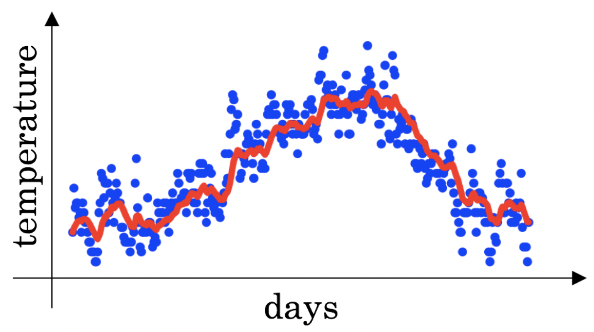

# Week 2 Quiz - Optimization Algorithms

1. Which notation would you use to denote the 3rd layer’s activations when the input is the 7th example from the 8th minibatch?

    - [x] $a^{[3]\{8\}(7)}$
    - [ ] $a^{[8]\{7\}(3)}$
    - [ ] $a^{[8]\{3\}(7)}$
    - [ ] $a^{[3]\{7\}(8)}$

2. Which of these statements about mini-batch gradient descent do you agree with?

    - [ ] Training one epoch (one pass through the training set) using mini-batch gradient descent is faster than training one epoch using batch gradient descent.
    - [x] One iteration of mini-batch gradient descent (computing on a single mini-batch) is faster than one iteration of batch gradient descent.
    - [ ] You should implement mini-batch gradient descent without an explicit for-loop over different mini-batches, so that the algorithm processes all mini-batches at the same time (vectorization).

3. Why is the best mini-batch size usually not 1 and not m, but instead something in-between? Check all that are true.

    - [ ] If the mini-batch size is $m$, you end up with stochastic gradient descent, which is usually slower than mini-batch gradient descent.
    - [x] If the mini-batch size is 1, you lose the benefits of vectorization across examples in the mini-batch.
    - [x] If the mini-batch size is $m$, you end up with batch gradient descent, which has to process the whole training set before making progress.
    - [ ] If the mini-batch size is 1, you end up having to process the entire training set before making any progress.

4. While using mini-batch gradient descent with a batch size larger than 1 but less than m, the plot of the cost function $J$ looks like this:

    

    You notice that the value of $J$ is not always decreasing. Which of the following is the most likely reason for that?

   - [x] In mini-batch gradient descent we calculate $J(\hat{y}^{\{t\}}, y^{\{t\}})$ thus witch each batch we compute over a new set of data.
   - [ ] The algorithm is on a local minimum thus the noisy behavior.
   - [ ] You are not implementing the moving averages correctly. Using moving averages will smooth the graph.
   - [ ] A bad implementation of the backpropagation process, we should use gradient check to debug our implementation.

5. Suppose the temperature in Casablanca over the first two days of January are the same:

    Jan 1st: $\theta_1 = 10^{\degree}C$

    Jan 2nd: $\theta_2 = 10^{\degree}C$

    Say you use an exponentially weighted average with $\beta = 0.5$ to track the temperature: $v_0 = 0, v_t = \beta v_{t-1} + (1 - \beta)\theta_t$. If $v_2$ is the value computed after day 2 without bias correction, and $v_2^{corrected}$ is the value you compute with bias correction. What are these values?

    - [ ] $v_2 = 10, v_2^{corrected} = 10$
    - [ ] $v_2 = 7.5, v_2^{corrected} = 7.5$
    - [ ] $v_2 = 10, v_2^{corrected} = 7.5$
    - [x] $v_2 = 7.5, v_2^{corrected} = 10$

6. Which of the following is true about learning rate decay?

    - [ ] The intuiting behind it is that for later epochs our parameters are closer to a minimum thus it is more convenient to take larger steps to accelerate the convergence.
    - [x] The intuition behind it is that for later epochs our parameters are closer to a minimum thus it is more convenient to take smaller steps to prevent large oscillations.
    - [ ] It helps to reduce the variance of a model.
    - [ ] We use it to increase the size of the steps taken in each mini-batch iteration.

7. You use an exponentially weighted average on the London temperature dataset. You use the following to track the temperature: $v_t = \beta v_{t-1} + (1 - \beta) \theta_t$. The red line below was computed using $\beta = 0.9$. What would happen to your red curve as you vary $\beta$? (Check the two that apply)

    

    - [ ] Decreasing $\beta$ will shift the red line slightly to the right.
    - [x] Increasing $\beta$ will shift the red line slightly to the right.
    - [x] Decreasing $\beta$ will create more oscillation within the red line.
    - [ ] Increasing $\beta$ will create more oscillations within the red line.

    > The key thing to remember is that the number of periods is approximately given by $1 / (1 - \beta)$. So with $\beta = 0.9$, then $1 / (1 - 0.9) = 1 / (0.1) = 10$

8. Consider this figure:

    

    These plots were generated with gradient descent; with gradient descent with momentum $(\beta = 0.5)$; and gradient descent with momentum $(\beta = 0.9)$. Which curve corresponds to which algorithm?

    - [x] (1) is gradient descent. (2) is gradient descent with momentum (small $\beta$). (3) is gradient descent with momentum (large $\beta$).
    - [ ] (1) is gradient descent with momentum (small $\beta$). (2) is gradient descent. (3) is gradient descent with momentum (large $\beta$)
    - [ ] (1) is gradient descent. (2) is gradient descent with momentum (large $\beta$). (3) is gradient descent with momentum (small $\beta$)
    - [ ] (1) is gradient descent with momentum (small $\beta$). (2) is gradient descent with momentum (small $\beta$). (3) is gradient descent.

9. Suppose batch gradient descent in a deep network is taking excessively long to find a value of the parameters that achieves a small value for the cost function $\mathcal{J}(W^{[1]}, b^{[1]}, \dots, W^{[L]}, b^{[L]})$. Which of the following techniques could help find parameter values that attain a small value for $\mathcal{J}$? (Check all that apply)

    - [x] Try mini-batch gradient descent
    - [x] Try using Adam
    - [ ] Try initializing all the weights to zero
    - [x] Try tuning the learning rate $\alpha$
    - [x] Try better random initialization for the weights

10. Which of the following statements about Adam is ***False***?

    - [ ] Adam combines the advantages of RMSProp and momentum.
    - [ ] The learning rate hyperparameter $\alpha$ in Adam usually needs to be tuned.
    - [ ] We usually use "default" values for the hyperparameters $\beta_1, \beta_2$ and $\epsilon$ in Adam $(\beta_1 = 0.9, \beta_2 = 0.999, \epsilon=10^{-8})$
    - [x] Adam should be used with batch gradient computations, not with mini-batches.
