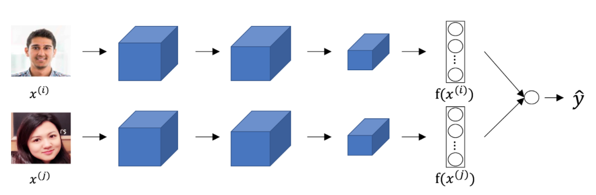

# Week 3 Quiz - Special Applications: Face Recognition & Neural Style Transfer

1. Face verification requires comparing a new picture against one person’s face, whereas face recognition requires comparing a new picture against K persons’ faces.

    - [ ] False
    - [X] True

2. Why is the face verification problem considered a one-shot learning problem? Choose the best answer.

    - [ ] Because we have only to forward pass the image one time through our neural network for verification.
    - [ ] Because of the sensitive nature of the problem, we won't have a chance to correct it if the network makes a mistake.
    - [X] Because we might have only one example of the person we want to verify.
        > Correct. One-shot learning refers to the amount of data we have to solve a task.
    - [ ] Because we are trying to compare to one specific person only.

3. You want to build a system that receives a person's face picture and determines if the person is inside a workgroup. You have pictures of all the faces of the people currently in the workgroup, but some members might leave, and some new members might be added. To train a system to solve this problem using the triplet loss you get many persons and take several pictures of each one. Which of the following do you agree with? (Select the best answer).

    - [ ] You take several pictures of the same person because this way you can get more pictures to train the network efficiently since you already have the person in place.
    - [X] You take several pictures of the same person to train $\text{d}(\text{img}_1, \text{img}_2)$ using the triplet loss.
        > Correct. To train using the triplet loss you need several pictures of the same person.
    - [ ] You shouldn't use persons outside the workgroup you are interested in because that might create a high variance in your model.
    - [ ] It would be best to increase the number of persons in the dataset by taking only one picture of each person to have a more representative set of the population.

4. In the triplet loss:

    $$
        \max \left( || f(A) - f(P) ||^2 - || f(A) - f(N)||^2 + \alpha, 0\right)
    $$

    Which of the following are true about the triplet loss? Chose all that apply.

    - [X] $f(A)$ represents the encoding of the Anchor.
        > Correct. $f$ represents the network that is in charge of creating the encoding of the images, and $A$ represents the anchor image.
    - [X] We want that $||f(A) - f(P)||^2 < ||f(A) - f(N)||^2$, so the negative images are further away from the anchor than the positive images.
        > Correct. Being a positive image the encoding of $P$ should be close to the encoding of $A$.
    - [ ] $\alpha$ is a trainable parameter of the Siamese network.
    - [ ] $A$ the anchor image is a hyperparameter of the Siamese network.

5. Consider the following Siamese network architecture:

    

    The upper and lower networks share parameters to have a consistent encoding for both images. True/False?

    - [ ] False
    - [X] True
        > Correct. Part of the idea behind the Siamese network is to compare the encoding of the images, thus they must be consistent.

6. Our intuition about the layers of a neural network tells us that units that respond more to complex features are more likely to be in deeper layers. True/False?

    - [ ] False
    - [X] True
        > Correct. Neurons that understand more complex shapes are more likely to be in deeper layers of a neural network.

7. Neural style transfer is trained as a supervised learning task in which the goal is to input two images $(x)$, and train a network to output a new, synthesized image $(y)$.

    - [ ] True
    - [X] False
        > Correct. Neural style transfer is about training the pixels of an image to make it look artistic, therefore there are no learnable parameters.

8. In the deeper layers of a ConvNet, each channel corresponds to a different feature detector. The style matrix $G^{[l]}$ measures the degree to which the activations of different feature detectors in layer $l$ vary (or correlate) together with each other.

    - [X] True
        > Yes, the style matrix $G^{[l]}$ can be seen as a matrix of cross-correlations between the different feature detectors.
    - [ ] False

9. In neural style transfer, which of the following better express the gradients used?

    - [ ] Neural style transfer doesn't use gradient descent since there are no trainable parameters.
    - [ ] $\frac{\partial J}{\partial S}$
    - [X] $\frac{\partial J}{\partial G}$
        > Correct. We are evaluating the cost function with respect to $G$, our generative image. That is, we use the gradient of the cost function over the value of the pixels of the generated image.
    - [ ] $\frac{\partial J}{\partial W^{[l]}}$

10. You are working with 3D data. You are building a network layer whose input volume has size $32 \times 32 \times 32 \times 16$ (this volume has $16$ channels), and applies convolutions with $32$ filters of dimension $3 \times 3 \times 3 \times 16$ (no padding, stride $1$). What is the resulting output volume?

    - [ ] Undefined: This convolution step is impossible and cannot be performed because the dimensions specified don't match up.
    - [X] $30 \times 30 \times 30 \times 32$
        > Correct, you have used the formula over the three first dimensions of the input data.
    - [ ] $30 \times 30 \times 30 \times 16$
