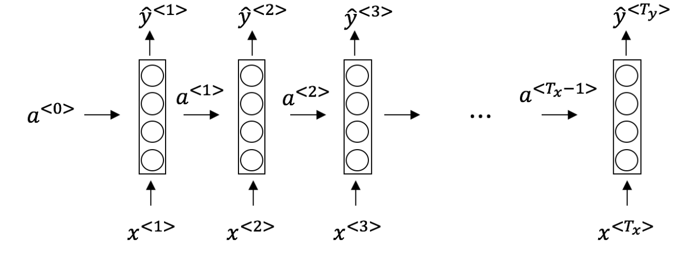
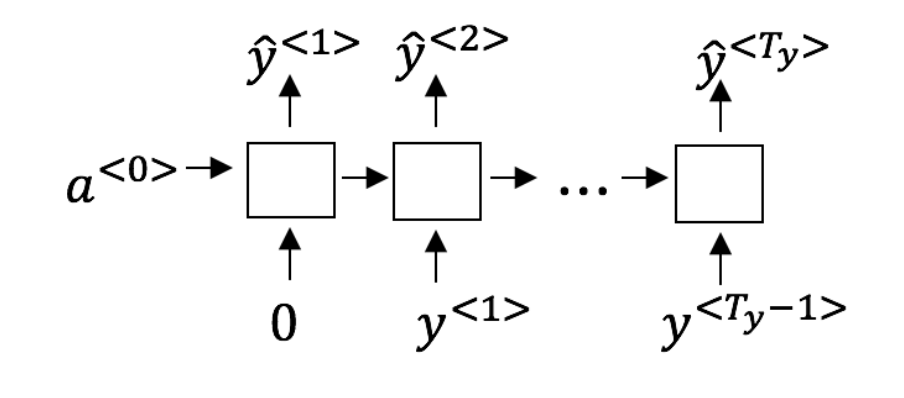
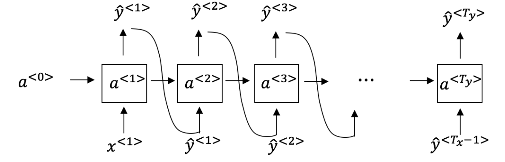

# Week 1 Quiz - Recurrent Neural Networks

1. Suppose your training examples are sentences (sequences of words). Which of the following refers to the $j^{th}$ word in the $i^{th}$ training example?

    - [X] $x^{(i)<j>}$
        > We index into the $i^{th}$ row first to get the $i^{th}$ training example (represented by parenthesis), then the $j^{th}$ column to get the $j^{th}$ word (represented by the brackets).
    - [ ] $x^{<i>(j)}$
    - [ ] $x^{(j)<i>}$
    - [ ] $x^{<j>(i)}$

2. Consider this RNN:

    

    True/False: This specific type of architecture is appropriate when $T_x > T_y$

    - [ ] True
    - [X] False
        > Correct! This type of architecture is for applications where the input and output sequence length is the same.

3. Select the two task combinations that could be addressed by a many-to-one RNN model architecture from the following:

    - [X] **Task 1:** Gender recognition from audio. **Task 2:** Movie review (positive/negative) classification
        > Gender recognition from audio and movie review classification are two examples of many-to-one RNN architecture
    - [ ] **Task 1:** Speech recognition. **Task 2:** Gender recognition from audio.
    - [ ] **Task 1:** Image classification. **Task 2:** Sentiment classification.
    - [ ] **Task 1:** Gender recognition from audio. **Task 2:** Image classification.

4. Using this as the training model below, answer the following:

    

    True/False: At the $t^{th}$ time step the RNN is estimating $P(y^{<t>} \mid y^{<1>}, y^{<2>}, \dots, y^{<t-1>})$

    - [ ] False
    - [X] True
        > Yes, in a training model we try to predict the next step based on knowledge of all prior steps.

5. You have finished training a language model RNN and are using it to sample random sentences, as follows:

    

    True/False: In this sample sentence, step t uses the probabilities output by the RNN to randomly sample a chosen word for that time-step. The int passes this selected word to the next time-step.

    - [ ] False
    - [X] True
        > Step t uses the probabilities output by the RNN to randomly sample a chosen word for that time-step. Then it passes this selected word to the next time-step.

6. True/False: If you are training an RNN model, and find that your weights and activations are all taking on the value of NaN ("Not a Number") then you have an exploding gradient problem.

    - [ ] False
    - [x] True
        > Correct! Exploding gradients happen when large error gradients accumulate and result in very large updates to the NN model weights during training. These weights can become too large and cause an overflow, identified as NaN.

7. Suppose you are training an LSTM. You have an 80000 word vocabulary, and are using an LSTM with 800-dimensional activations $a^{<t>}$. What is the dimension of $\Gamma_u$ at each time step?

    - [ ] 80000
    - [ ] 8
    - [X] 800
        > Correct, $\Gamma_u$ is a vector of dimension equal to the number of hidden units in the LSTM.
    - [ ] 100

8. Sarah proposes to simplify the GRU by always removing the $\Gamma_u$. I.e., setting $\Gamma_u = 0$. Ashely proposes to simplify the GRU by removing the $\Gamma_r$. I.e., setting $\Gamma_r = 1$ always. Which of these models is more likely to work without vanishing gradient problems even when trained on very long input sequences?

    - [ ] Ashely's model (removing $\Gamma_r$), because if $\Gamma_u \approx 1$ for a time step, the gradient can propagate back through that time step without much decay.
    - [X] Ashely's model (removing $\Gamma_r$), because if $\Gamma_u \approx 0$ for a time step, the gradient can propagate back through that time step without much decay.
      > Yes. For the signal to back propagate without vanishing, we need $c^{<t>}$ to be highly dependent on $c^{<t-1>}$.
    - [ ] Sarah's model (removing $\Gamma_u$), because if $\Gamma_r \approx 0$ for a time step, the gradient can propagate back through that time step without much decay.
    - [ ] Sarah's model (removing $\Gamma_u$), because if $\Gamma_r \approx 1$ for a time step, the gradient can propagate back through that time step without much decay.

9. Here are the equations for the GRU and the LSTM:

    From these, we can see that the Update Gate and Forget Gate in the LSTM play a role similar to `blank` and `blank` in the GRU. What should go in the blanks?

    - [X] $\Gamma_u$ and $1 - \Gamma_u$
        > Yes, correct!
    - [ ] $\Gamma_u$ and $\Gamma_r$
    - [ ] $1 - \Gamma_u$ and $\Gamma_u$
    - [ ] $\Gamma_r$ and $\Gamma_u$

10. You have a pet dog whose mood is heavily dependent on the current and past few days' weather. You've collected data for the past 365 days on the weather, which you represent as a sequence $x^{<1>}, \dots, x^{<365>}$. You've also collected data on your dog's mood, which you represent as $y^{<1>}, \dots, y^{<365>}$. You'd like to build a model to map from $x \to y$. Should you use a Unidirectional RNN or Bidirectional RNN for this problem?

    - [ ] Bidirectional RNN, because this allows the prediction of mood on day t to take into account more information.
    - [ ] Bidirectional RNN, because this allows back propagation to compute more accurate gradients.
    - [X] Unidirectional RNN, because the value of $y^{<t>}$ depends only on $x^{<1>}, \dots, x^{<t>}$, but not on $x^{<t+1>}, \dots, x^{<365>}$.
        > Yes!
    - [ ] Unidirectional RNN, because the value of $y^{<t>}$ depends only on $x^{<t>}$, and not other days' weather.
