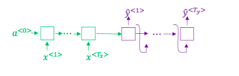

# Week 3 Quiz - Sequence Models & Attention Mechanism

1. Consider using this encoder-decoder model for machine translation.

    

    True/False: This model is a "conditional language model" in the sense that the decoder portion (shown in purple) is modeling the probability of the output sentence $y$ given the input sentence $x$

    - [X] True
        > The encoder-decoder model for machine translation models the probability of the output sentence y conditioned on the input sentence x.
    - [ ] False

2. In beam search, if you decrease the beam width $B$, which of the following would you expect to be true? Select all that apply.

    - [ ] Beam search will generally find better solutions (i.e. do a better job maximizing *P(y|x)*)
    - [X] Beam search will converge after fewer steps.
        > As the beam width decreases, beam search runs more quickly, uses up less memory, and converges after fewer steps, but will generally not find the maximum P(y|x).
    - [X] Beam search will run more quickly
        > As the beam width decreases, beam search runs more quickly, uses up less memory, and converges after fewer steps, but will generally not find the maximum P(y|x).
    - [ ] Beam search will use up more memory.

3. True/False: In machine translation, if we carry out beam search using sentence normalization, the algorithm will tend to output overly short translations.

    - [X] False
        > In machine translation, if we carry out beam search without using sentence normalization, the algorithm will tend to output overly short translations.
    - [ ] True

4. Suppose you are building a speech recognition system, which uses an RNN model to map from audio clip $x$ to text transcript $y$. Your algorithm uses beam search to try to find the value of $y$ that maximizes $P(y \mid x)$.

    On a dev set example, given an input audio clip, your algorithm outputs the transcript $\hat{y} = \text{"I'm building an A Eye system in Silly con Valley."}$, whereas a human gives a much superior transcript $y^* = \text{"I'm building an AI system in Silicon Valley."}$

    According to your model:

    - $P(\hat{y} \mid x) = 7.21 \times 10^{-8}$
    - $P(y^* \mid x) = 1.09 \times 10^{-7}$

    Would you expect increasing the beam with $B$ to help correct this example?

    - [X] Yes, because $P(y^{\\*} \mid x) > P(\hat{y} \mid x)$ indicates the error should be attributed to the search algorithm rather than to the RNN.
        > $P(y^* \mid x) > P(\hat{y} \mid x)$ indicates the error should be attributed to the search algorithm rather than to the RNN. Increasing the beam width will generally allow beam search to find better solutions.
    - [ ] No, because $P(y^* \mid x) > P(\hat{y} \mid x)$ indicates the error should be attributed to the RNN than to the search algorithm.
    - [ ] No, because $P(y^* \mid x) > P(\hat{y} \mid x)$ indicates the error should be attributed to the search algorithm rather than the RNN.
    - [ ] Yes, because $P(y^* \mid x) > P(\hat{y} \mid x)$ indicates the error should be attributed to the RNN rather than to the search algorithm.

5. Continuing the example from Q4, suppose you work on your algorithm for a few more weeks, and now find that for the vast majority of examples on which your algorithm makes a mistake, $P(y^* \mid x) > P(\hat{y} \mid x)$. This suggests you should not focus your attention on improving the search algorithm.

    - [X] False
        > $P(y^* \mid x) > P(\hat{y} \mid x)$ indicates the error should be attributed to the search algorithm rather than to the RNN.
    - [ ] True

6. Consider the attention model for machine translation,

    

    Further, here is the formula for $\alpha^{<t, t'>}$:

    $$
        a^{<t, t'>} = \frac{\exp(e^{<t,t'>})}{\sum_{t'=1}^{T_x} \exp(e^{<t,t'>})}
    $$

    Which of the following statements about $\alpha^{<t,t'>}$ are true? Check all that apply.

    - [X] $\sum_{t'} \alpha^{<t,t'>} = 1$
        > Correct. If we sume over $\alpha^{<t,t'>}$ for all $t'$, the numerator will be equal to the denominator, therefore $\sum_{t'}\alpha^{<t,t'>} = 1$
    - [X] We expect $\alpha^{<t,t'>}$ to be generally larger for values of $a^{<t'>}$ that are highly relevant to the values the network should output for $y^{\<t\>}$
        > Correct. $\alpha^{<t,t'>}$ is equal to the amount of attention $y^{<t>}$ should pay to $\alpha^{<t'>}$. So, if a value of $a^{<t'>}$ is highly relevant to $y^{<t>}$, then the attention coefficient $\alpha^{<t,t'>}$ should be larger.
    - [ ] $\sum_{t} \alpha^{<t,t'>} = 1$
    - [ ] We expect $\alpha^{<t,t'>}$ to be generally larger for values of $a^{\<t\>}$ that are highly relevant to the values the network should output for $y^{\<t'\>}$

7. The network learns where to "pay attention" by learning values $e^{<t,t'>}$, which are computer using a small neural network.

    Which of the following does $s^{<t>}$ depend on? Select all that apply.

    - [X] $a^{<t,t'>}$
        > $s^{<t>}$ depends on $a^{<t,t'>}$ which in turn depends on $e^{<t,t'>}$.
    - [ ] $s^{<t+1>}$
    - [x] $e^{<t,t'>}$
        > $s^{<t>}$ depends on $a^{<t,t'>}$ which in turn depends on $e^{<t,t'>}$.
    - [ ] $s^t$ is independent of $\alpha^{<t,t'>}$ and $e^{<t,t'>}$

8. The attention model performs the same as the encoder-decoder model, no matter the sentence length.

    - [X] False
        > The performance of the encoder-decoder model declines as the amount of words increases. The attention model has the greatest advantage when the input sequence length $T_x$ is large.
    - [ ] True

9. Under the CTC model, identical repeated characters not separated by the "blank" character (_) are collapsed. Under the CTC model, what does the following string collapse to?

    `aaa_aaaaaa________rr_ddddddddd_______v_aaaaaa_rrrr________kk`

    - [ ] ardvark
    - [ ] aa rd var k
    - [ ] aaaaaaaaarrdddddddddvaaaaaarrrrkk
    - [X] aardvark
        > The basic rule for CTC cost function is to collapse repeated characters not separated by "blank". If a character is repeated, but separated by a "blank" it is included in the string.

10. In trigger word detection, $x^{<t>}$ represents the trigger word $x$ being stated for the *t*-th time.

    - [X] False
        > $x^{<t>}$ represents the features of the audio at time $t$.
    - [ ] True
