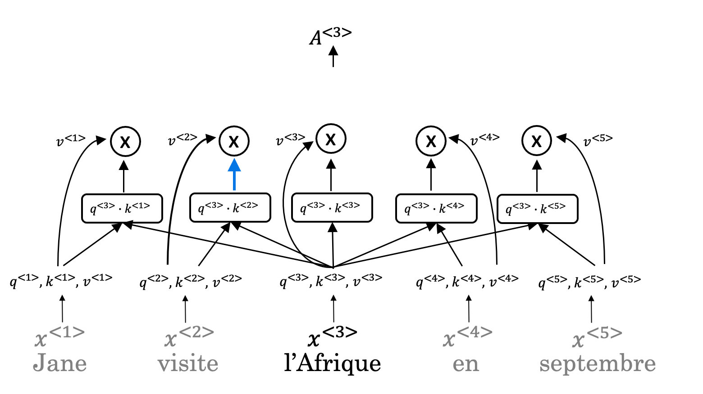

# Week 4 Quiz - Transformers

1. A Transformer Network processes sentences from left to right, one word at a time.

    - [X] False
        > A Transformer Network can ingest entire sentences all at the same time.
    - [ ] True

2. Transformer Network methodology is taken from:

    - [ ] RNN and LSTMs
    - [ ] Attention Mechanism and RNN style of processing.
    - [ ] GRUs and LSTMs
    - [X] Attention Mechanism and CNN style of processing.
        > Transformer architecture combines the use of attention based representations and a CNN convolutional neural network style of processing.

3. How does the Self-Attention mechanism of transformers use neighboring words to compute a word's context?

    

    - [ ] Multiplication of the word values to map the Attention related to that given word.
    - [ ] Selecting the minimum word values to map the Attention related to that given word.
    - [X] Summation of the word values to map the Attention related to that given word.
        > Given a word, its neighboring words are used to compute its context by summing up the word values to map the Attention related to that given word.
    - [ ] Selecting the maximum word values to map the Attention related to that given word.

4. What letter does the "?" represent in the following representation of *Attention*?

    $$
        \text{Attention}(Q, K, V) = \text{softmax}\left(\frac{QK^T}{\sqrt{d_?}} V\right)
    $$

    - [ ] t
    - [ ] q
    - [ ] v
    - [X] k
        > k is represented by the ? in the representation.

5. Are the following statements true regarding the Query (Q), Key (K) and Value(V)?

    Q = interesting questions about the words in a sentence.
    K = qualities of words given a Q
    V = specific representations of words given a Q

    - [ ] False
    - [X] True
        > Q = interesting questions about the words in a sentence, K = qualities of words given a Q, V = specific representations of words given a Q

6. $\text{Attention}(W_i^Q Q, W_i^K K, W_i^V V)$

    $i$ here represents the computed attention weight matrix associated with the $ith$ "head" (sequence).

    - [X] True
        > *i* here represents the computed attention weight matrix associated with the “head” (sequence).
    - [ ] False

7. Following is the architecture with a Transformer Network **(without displaying positional encoding and output layer(s))**

    

    What is generated from the output of the *Decoder's* first block of *Multi-Head Attention*?

    - [ ] V
    - [X] Q
        > This first block’s output is used to generate the Q matrix for the next Multi-Head Attention block.
    - [ ] K

8. Following is the architecture with a Transformer Network **(without displaying positional encoding and output layer(s))**

    

    The output of the decoder block contains a softmax layer followed by a linear layer to predict the next word one word at a time.

    - [ ] True
    - [X] False
        > The output of the decoder block contains a linear layer followed by a softmax layer to predict the next word one word at a time.

9. Why is positional encoding important in the translation process? (Check all that apply)

    - [X] Position and word order are essential in sentence construction of any language.
    - [ ] It helps to locate every word within a sentence.
    - [ ] It is used in CNN and works well here.
    - [X] Providing extra information to our model.

10. Which of these is ***not*** a good criterion for a good positional encoding algorithm?

    - [ ] Distance between any two time-steps should be consistent for all sentence lengths.
    - [ ] The algorithm should be able to generalize to longer sentences.
    - [ ] It must be deterministic.
    - [X] It should output a common encoding for each time-step (word's position in a sentence)
        > The encoding should be unique, instead of common.
